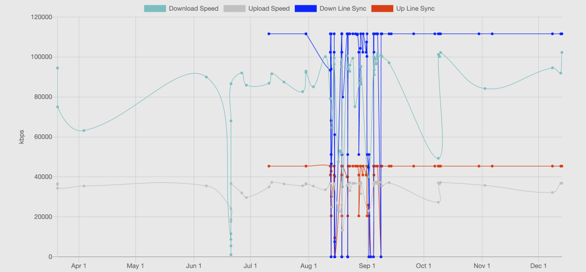

# Aussie Broadband Management Dashboard

This is a project I started to create when I had an intermitent issue with my FttC.

At this time it records DPU Port Status (Up/Down line sync speed), and collects Speed Test from Aussies speed test server.




# Running

Create a volume for your database to live on:
```
docker volume create abbdata
```

Start the docker container:
```
docker run --name aussiebbmgt -v abbdata:/data -p 5000:5000 aussiebbmgt
```

## Debugging

To debug the collector, add `-eDEBUG=true` to the docker command.

To debug flask, add `-eFLASK_ENV=development` to the docker command.


# Development

This project uses abb-speedtest-cli by @lukealford and aussiebb by @mikalstill.

It is developed using jquery, bootstrap, chartjs and flask.

There are some old versions of development code and examples using matplot to draw graphs in utils and archive directories.

## Setup
```
virtualenv .venv
source .venv/bin/activate
pip install -r requirements.txt
```

## Run the flask app
```
flask run
```

## Pull data about DPU and Speed test results and store it in the local database
```
./dpuportstatuspopulate.py; ./speedtestpopulate.py
```

## Run a DPU Port Status
```
./rundpuportstatus.py
```

## Speed Test
Project: https://github.com/lukealford/abb-speedtest-cli
```
docker run --rm -e TZ=Australia/Sydney abb-speedtest
```
